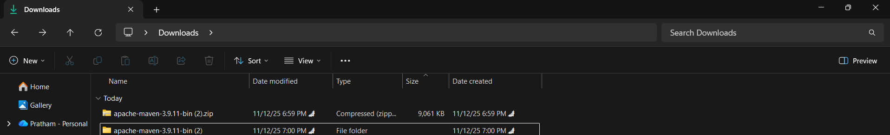
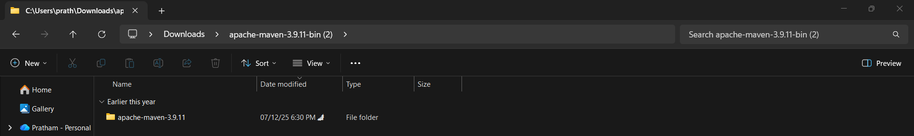
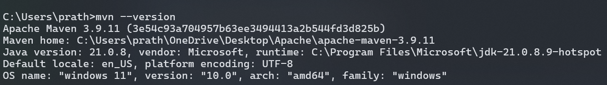
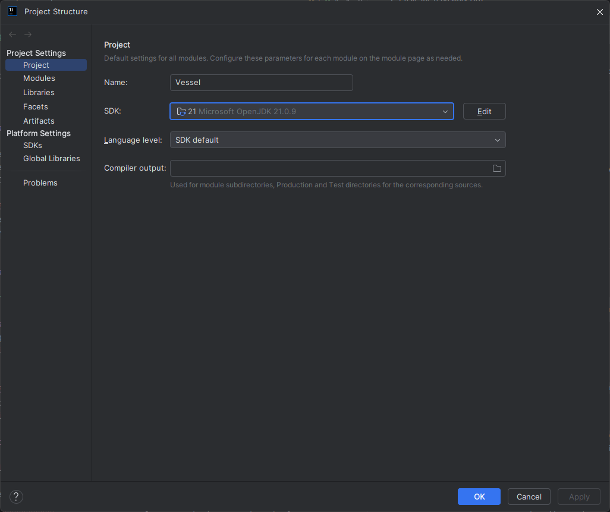
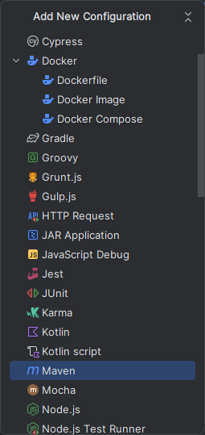
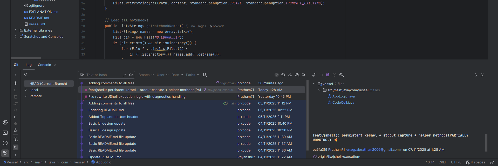
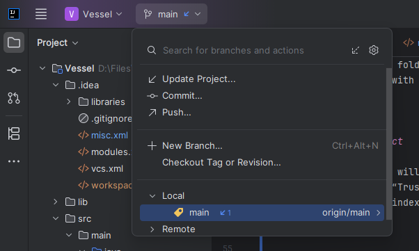

# Vessel

# Setting Up GitHub & Cloning the Repository in IntelliJ IDEA

## 1. Prerequisites

Before starting, ensure you have:

* [Git](https://git-scm.com/downloads) installed on your computer.
* [IntelliJ IDEA](https://www.jetbrains.com/idea/download/) (Community or Ultimate Edition)
* The **GitHub account** where you received the repository invite in.
* Java's JDK 21
* [Maven](https://dlcdn.apache.org/maven/maven-3/3.9.11/binaries/apache-maven-3.9.11-bin.zip) installed on your computer.
  
---
## 2. Configuring Maven
* Install it using [Maven](https://dlcdn.apache.org/maven/maven-3/3.9.11/binaries/apache-maven-3.9.11-bin.zip).

### 2.1 Extract Maven.zip



### 2.2 Copy path
It should look like this:
``` C:\Users\prath\Downloads\apache-maven-3.9.11-bin (2)\apache-maven-3.9.11\bin ```

### 2.3 Adding Maven to path


### 2.4 Sanity check.
Open command prompt and use ``` mvn --version ```


----

## 3. Cloning the Private Repository

1. In IntelliJ, go to **File → New → Project from Version Control → Git**.
2. Paste the repository URL:

   ```
   https://github.com/Pratham71/Vessel.git
   ```
3. Choose a destination folder and click **Clone**.
4. If prompted, log in with your GitHub credentials or personal access token.

---

## 4. Opening the Project

* Once cloned, IntelliJ will automatically open the project.
* If prompted, click **“Trust Project”**.
* Wait for IntelliJ to index and import dependencies (Gradle/Maven/etc.).

* ### Additional Check (important)
  * Go to settings → project structure
  * Make sure your JDK version is correctly set to **JDK 21** (doesn't matter if it shows as `21` or `ms-21`)
  > 

---
## 5. Setting up Maven in IntelliJ

> 💡 You don’t need to use terminal commands — IntelliJ can handle Maven automatically.

### 1. **Ensure Maven is Loaded**
- On the right sidebar, open the **Maven** tool window (icon looks like an italicized lowercase "*m*").
- If it’s hidden, go to **View → Tool Windows → Maven**.
- Click the 🔄 **Reload All Maven Projects** icon to sync `pom.xml`.

### 2. **Build the Project**
- From the top menu, go to **Build → Build Project** (`Ctrl + F9` / `Cmd + F9`).
- This compiles all files in `src/main/java` and places outputs in the `target/` folder.

### 3. **Setup Run Config**

- In IntelliJ, go to **Run → Edit Configurations**.
- Click the **+** button and choose **Maven** (not Application).
- For **Name**, enter something like `Run Vessel`.
- *(Usually auto-filled)* For the **Working directory**, select your project root folder.
- In the **Command line** (or **Goals**) field, put this exactly:

   ```
   javafx:run
   ```
- Click **Apply** and then **OK**. Your steps should look something like this:

    > 
    
    > 

    > 

    > 💡 This final run button should automatically run your project from anywhere without needing to do additional maven actions


### 4. **Rebuild if Needed**
- If IntelliJ shows outdated code or dependency issues, select **Build → Rebuild Project**.

> ✅ If you're setting up your project for its first ever run - **you're done after this step**! The rest of this document simply has additional info you may need later/in other cases

---

### ⚙️ Basic Maven Commands
> 💡 You probably wont use these much since IntelliJ's UI kinda has everything in it, but these are here *just* in case

| Command | Description |
|----------|-------------|
| `mvn -v` | Check Maven version (verify installation). |
| `mvn clean` | Deletes the `target/` folder to ensure a fresh build. |
| `mvn compile` | Compiles all project source files (`src/main/java`). |
| `mvn package` | Packages the project into a `.jar` file inside `target/`. |
| `mvn install` | Builds and installs the JAR into your local Maven repository (`~/.m2`). |
| `mvn site` | Generates a project site/documentation if configured. |
| `mvn dependency:tree` | Displays a visual tree of all dependencies (useful for debugging conflicts). |
| `mvn validate` | Checks that the `pom.xml` and project structure are correct. |
| `mvn verify` | Runs integration tests after packaging (if any). |
| `mvn exec:java -Dexec.mainClass="com.vessel.Main"` | Runs your main class directly from Maven. |

---

### 🧹 Useful Tips
- Always run `mvn clean package` after editing `pom.xml` or adding dependencies.
- Use `mvn dependency:tree` to detect version clashes or duplicates.
- If dependencies fail to load, delete `.m2/repository` and rebuild with `mvn clean install`.
- IntelliJ automatically handles Maven imports — you can reload via the “Load Maven Changes” popup anytime.

---

### 💡 Tips
- If IntelliJ doesn’t recognize new dependencies, click **“Load Maven Changes”** at the top-right.
- To view Maven tasks (clean, package, install): open the **Maven** sidebar → expand your project → run any goal by double-clicking it.

---
## Running the App (Alternate Method)
> ⚠️ The normal play button should work if you've set up the `Run/Debug Config` properly in the previous steps; if not then follow this gif to run the program
 


---
## 6. Basic Git Operations in IntelliJ



### Check Git Status

* Open the **Git** tool window at the bottom (or use `Alt + 9`/ `Ctrl + Shift + G` / `Cmd + 9`).
* You’ll see all modified files, main commits and branched commits listed.

---



### Commit Changes

1. In the top branch icon click **Commit** or press `Ctrl + K` / `Cmd + K`.
2. Write a meaningful commit message (eg: "Added cell creation logic").
3. Select the files to commit.
4. Click **Commit** or **Commit and Push**.

* Its healthier to make multiple commits per feature/update being implemented, rather than having one messy commit having too many features in it, making it harder to track

### Push Changes

* Use **Push** or shortcut `Ctrl + Shift + K` / `Cmd + Shift + K` to push changes to the remote server.

### Pull Updates

* The blue arrow next to `main` (or whatever branch you're on) indicates new changes from remote ready to be pulled
* Use **Pull** to sync the latest changes from the remote branch.

### Branch Management

* Create, switch, or merge branches directly from the menu.
> 💡 Push major changes to branches, rather than main to avoid disrupting stable code; merge back once completed
---
### 🧠 How to Add a Dependency in Maven (For Future Stuff)

1. Open your project’s `pom.xml`.
2. Inside the `<dependencies>` tag, add the library you need in this format:

```xml
<dependencies>
    <!-- Example: Adding Gson for JSON parsing -->
    <dependency>
        <groupId>com.google.code.gson</groupId>
        <artifactId>gson</artifactId>
        <version>2.11.0</version>
    </dependency>

    <!-- Example: JavaFX Controls -->
    <dependency>
        <groupId>org.openjfx</groupId>
        <artifactId>javafx-controls</artifactId>
        <version>21.0.2</version>
    </dependency>

    <!-- Add more dependencies below -->
</dependencies>
```

---

### 🔗 Adding Local JARs (If Not Available on Maven Central)

If your library is not available online (for example, `ikonli-core.jar` in `/lib`), you can manually include it in `pom.xml` like this:

```xml
<dependency>
    <groupId>local.libs</groupId>
    <artifactId>ikonli-core</artifactId>
    <version>12.3.1</version>
    <scope>system</scope>
    <systemPath>${project.basedir}/lib/ikonli-core-12.3.1.jar</systemPath>
</dependency>
```
---

## Overview of Project Structre
```
Vessel
│
├─ .idea/
├─ logs/
├─ notebooks/
├─ readme.meta
├─ target/
│
├─ src
│  └─ main
│     ├─ java
│     │  └─ com.vessel
│     │     ├─ core
│     │     │  └─ log
│     │     │     └─ log-usage.md
│     │     │
│     │     ├─ Kernel
│     │     │  ├─ ExecutionResult
│     │     │  └─ NotebookEngine
│     │     │
│     │     ├─ model
│     │     │  ├─ CellType
│     │     │  ├─ Notebook
│     │     │  └─ NotebookCell
│     │     │
│     │     ├─ persistence
│     │     │  ├─ NotebookPersistence
│     │     │  └─ persistence.md
│     │     │
│     │     ├─ ui
│     │     │  ├─ CodeCellController
│     │     │  ├─ GenericCellController
│     │     │  ├─ NotebookController
│     │     │  └─ SystemThemeDetector
│     │     │
│     │     └─ util
│     │        ├─ SyntaxService
│     │        └─ Backend-Readme.md
│     │
│     └─ resources
│        ├─ CodeCell.fxml
│        ├─ Notebook.fxml
│        ├─ dark.css
│        ├─ light.css
│        └─ icon.png
│
├─ pom.xml
├─ .gitignore
├─ README.md
└─ EXPLANATION.md
---
